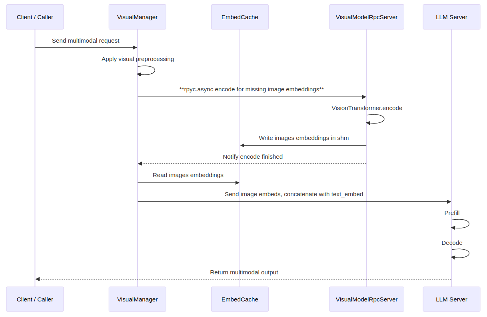
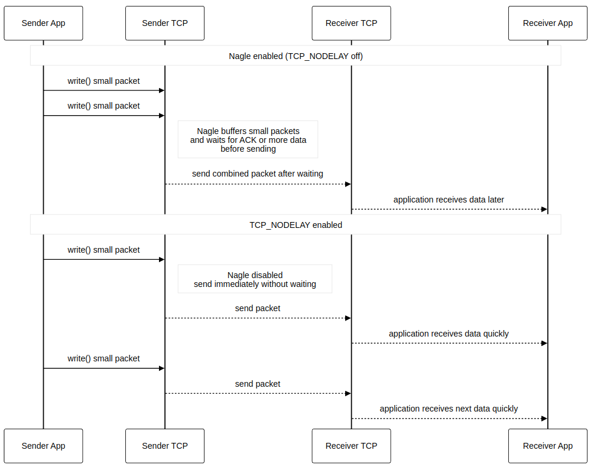
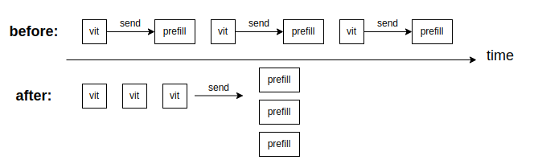

In LightLLM, multimodal inference is mainly divided into two stages: first, the input images are preprocessed and then passed through the vision encoder to obtain image embeddings; next, these image embeddings are concatenated with text embeddings and fed into the LLM for generation.

During the integration of MinuerU, we optimized the communication layer, reworked the ViT batching and scheduling logic, and streamlined the image preprocessing pipeline. These changes brought noticeable performance gains under various resolutions and hardware configurations.

## MinuerU Multimodal Inference Workflow in LightLLM

1. **Image preprocessing** (resize, normalization, and other operations following the visual spec).
2. Use **RPyC to call the remote ViT** and generate image embeddings.
3. **Embedding fusion**: concatenate image embeddings with text embeddings.
4. **LLM decoding**: feed the combined sequence into the LLM for generation.

  

During integration, we observed that the TCP behavior of RPyC, as well as the strong coupling between ViT batch size and downstream scheduling, were major sources of latency—especially for small images and high-concurrency workloads.

## Reducing RPyC Overhead with `TCP_NODELAY`

We noticed that default RPyC operations introduce about 20 ms of fixed delay due to TCP’s Nagle algorithm, which buffers small packets and delays sending. This adds unnecessary wait time to certain RPyC calls.

To avoid this, we explicitly enabled **`TCP_NODELAY`** on the RPyC connection.

  

After enabling **`TCP_NODELAY`**, on an H200 using **448×448** low-resolution images for batch inference, we observed that—on a fixed test set of around 1000 images—QPS improved from 30 req/s to 60 req/s, effectively doubling throughput and **significantly reducing time-to-first-token latency**.

This optimization is particularly beneficial in scenarios with many small requests or strict latency SLAs.

## Optimizing ViT Batching and Scheduling Behavior

Previously, the ViT batch size was solely determined by the parameter `visual_infer_batch_size`: ViT would perform forward passes using that batch size, collect `visual_infer_batch_size` embeddings, and once the threshold was reached, execute `infer_imgs` and **immediately** dispatch corresponding requests downstream.

On GPUs with small memory (e.g., 4090D), `visual_infer_batch_size` can only be set to 1, as larger values easily cause OOM. This leads to:

- Frequent small `send_pyobj` calls, increasing overhead.
- ViT sending embedding batches of size 1 to the LLM side, causing the LLM’s prefill batch size to be fixed at 1 and underutilizing GPU compute.

  

We reworked the main loop and **decoupled** ViT batching from embedding dispatch. This allows:

- **Reduced small RPyC message frequency**, lowering `send_pyobj` overhead.
- Maintain high ViT utilization with `visual_infer_batch_size`, while using `visual_send_batch_size` to build efficient downstream prefill batches.
- Lower **end-to-end latency jitter** under high concurrency.

## Accelerating Image Preprocessing

We also found that when image resolution is large (e.g., 4K or 8K), **image preprocessing** becomes a significant contributor to overall multimodal inference latency. To address this, we streamlined several operations in the preprocessing pipeline.

In the transformers library, Qwen2-VL models perform preprocessing on the CPU. We found that operations such as resize are significantly slower on GPU than on CPU. For a 4K image, resize takes about 20 ms on CPU but only about 3 ms on GPU. Based on this, we moved some preprocessing steps onto the GPU, greatly reducing **image preprocessing** overhead.

## Flash-Attention Kernel Selection

As is well known, attention is one of the most time-consuming components in large-model inference, and many vendors provide their own Flash-Attention implementations. On NVIDIA H-series GPUs, Tri Dao’s FlashAttention-3 is unquestionably the fastest. However, on the 4090 series, implementations differ between vendors.

We benchmarked several common open-source Flash-Attention implementations on the 4090. Using MinuerU-2.5 as an example, with:
**[SHAPE] B=1, H=16, L=7956, D=80, dtype=torch.bfloat16**

Performance results:
- sgl_kernel: **2.711 ms**
- xFormers: **2.791 ms**
- torch.sdpa: **2.906 ms**

Therefore, we replaced the Flash-Attention implementation with the one from `sgl_kernel` (which uses Flashinfer’s Flash-Attention on 4090D).

## Performance Evaluation

On RTX 4090D hardware, we compared LightLLM with vLLM using the same MinuerU model and comparable configurations.

### RTX 4090D, 10 concurrent requests, test set with 1000 images

| Metric | vLLM | LightLLM |
|:--|:--:|:--:|
| QPS (req/s) | 1.40 | 1.56 |
| Prefill P50 (ms) | 1140 | 640 |
| Decode P50 (ms) | 5.88 | 5.80 |

Overall, under comparable settings, **MinuerU running on LightLLM achieves slightly higher QPS than vLLM**, and the optimized communication, batching, and preprocessing strategies help stabilize and enhance end-to-end performance.

## Lightllm new features
LightLLM now supports decoupling the ViT module from the LLM, and the two components can run on different GPUs or even on different machines. With only a shared storage space, the ViT service can handle image encoding, while the LLM service only consumes the image embeddings and performs subsequent text generation. This allows resource planning for the vision side and the language side to be done independently: the ViT uses only its own compute and memory, and the LLM is no longer constrained by the compute and memory usage of image forward passes.

Under this separated architecture, the overall performance of the multimodal inference system can be clearly improved. On the one hand, the compute and memory cost of the ViT is isolated on dedicated nodes, which reduces its impact on LLM throughput, context length, and model size. On the other hand, image embeddings can be reused in shared storage, and different requests and different LLM instances can directly read existing image representations, which reduces the cost of repeated computation.

We benchmarked three settings under the same workload (average input length 1299 tokens, average output length 128 tokens): (1) a coupled setup with 1×GPU running LLM+ViT, (2) a separated setup with 1×GPU LLM + 1×GPU ViT, and (3) an image-embed cache-hit setup where all requests reuse existing image embeddings and no ViT forward is needed.

| Setup                                      | Total QPS | Total throughput (tok/s) | P50 request time (s) | P50 first token (s) | P50 decode token (ms) |
|-------------------------------------------|----------:|-------------------------:|----------------------:|---------------------:|-----------------------:|
| 1×GPU LLM + ViT (coupled)                 |     7.13  |                 10171.29 |                 61.83 |                36.98 |                 133.68 |
| 1×GPU LLM + 1×GPU ViT (separated)         |     9.25  |                 13195.12 |                 29.77 |                19.19 |                 121.91 |
| image-embed cache hit (no ViT inference)  |     9.44  |                 13465.00 |                 28.94 |                18.37 |                 121.40 |

Compared with the coupled baseline, separating ViT from the LLM increases QPS and total token throughput by about 30% (7.13 → 9.25 QPS, 10.2k → 13.2k tokens/s). The median time to the first token drops from 36.98 s to 19.19 s, which is roughly a 48% reduction, and the median end-to-end request latency drops from 61.83 s to 29.77 s, which is roughly a 52% reduction. Decode-time latency also improves slightly.

The image-embed cache-hit case shows the upper bound when ViT computation is entirely offloaded or reused: 9.44 QPS, 13.5k tokens/s, and 18.37 s median first-token time. The separated ViT+LLM setup is already very close to this limit, which indicates that the remaining overhead from vision processing on the LLM side is small once ViT is decoupled and image embeddings can be shared.